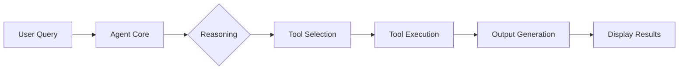

# 🤖 AI Agent Learning Dashboard

Una dashboard interattiva per comprendere come funzionano gli agenti AI moderni, con focus su reasoning, system prompt, paradigma TAO (Thought-Action-Observation) e tool esterni.


## 📋 Sommario

- [Introduzione](#-introduzione)
- [Features](#features)
- [Installazione](#installazione)
- [Uso della Dashboard](#uso-della-dashboard)
- [Architettura](#architettura)
- [Esempi Pratici](#esempi-pratici)
- [Personalizzazione](#personalizzazione)
- [Contribuire](#contribuire)

## 🎯 Introduzione

Questa dashboard educativa è stata creata per aiutare studenti, data scientist e ML engineer a comprendere il funzionamento interno degli agenti AI. Attraverso visualizzazioni interattive e esempi concreti di anomaly detection, mostra come un agente AI:

- **Ragiona** attraverso step sequenziali
- **Utilizza tool esterni** per accedere a dati e computazione
- **Itera** attraverso cicli Thought-Action-Observation
- **Produce output concreti** e misurabili

### 🎓 A chi è rivolta

- Studenti di Data Science e Machine Learning
- ML Engineers che vogliono capire meglio gli AI Agent
- Sviluppatori interessati ai Large Language Models (LLM)
- Chiunque voglia comprendere come funziona l'AI "sotto il cofano"

## ✨ Features

### 1. Agent Flow Completo
Visualizzazione step-by-step del processo di elaborazione con:
- ⏱️ Timing reale per ogni operazione
- 📊 Output concreti dopo ogni step
- 🔧 Tool calls espliciti con parametri e risultati
- 🎬 Animazione controllabile del flusso

### 2. Tool Esterni
Panoramica completa degli strumenti che un agente AI può utilizzare:
- 🌐 **Web Search**: Ricerca informazioni real-time
- 📄 **File Reader**: Analisi di CSV, JSON, Excel
- 💻 **Code Executor**: Esecuzione di codice Python
- 🗄️ **Database Query**: Interrogazione dati storici
- 🤖 **ML Model**: Applicazione modelli pre-addestrati

### 3. Paradigma TAO
Implementazione pratica del ciclo Thought-Action-Observation:
- 🧠 **Thought**: Il ragionamento interno dell'agente
- ⚡ **Action**: Le operazioni eseguite
- 👁️ **Observation**: La valutazione dei risultati
- ✅ **Output**: I risultati concreti prodotti

### 4. System Prompt Editor
Editor interattivo per:
- ✏️ Modificare il comportamento dell'agente
- 🎯 Testare diversi prompt
- 📈 Visualizzare l'impatto delle modifiche
- 📋 Utilizzare template predefiniti

## 🚀 Installazione

### Prerequisiti
- Node.js 16+ 
- npm o yarn
- Browser moderno (Chrome, Firefox, Safari, Edge)

### Setup Rapido

1. **Clona il repository**
```bash
git clone https://github.com/tuouser/ai-agent-dashboard.git
cd ai-agent-dashboard
```

2. **Installa le dipendenze**
```bash
npm install
# oppure
yarn install
```

3. **Avvia il server di sviluppo**
```bash
npm start
# oppure
yarn start
```

4. **Apri nel browser**
```
http://localhost:3000
```

### Setup in React App Esistente

Se vuoi integrare la dashboard in un progetto React esistente:

1. **Copia il componente**
```bash
cp AIAgentDashboard.jsx /path/to/your/project/components/
```

2. **Installa dipendenze necessarie**
```bash
npm install lucide-react
```

3. **Importa e usa il componente**
```jsx
import AIAgentDashboard from './components/AIAgentDashboard';

function App() {
  return <AIAgentDashboard />;
}
```

## 📖 Uso della Dashboard

### Navigazione Base

```
┌─────────────────────────────────────────────────┐
│  🤖 Come Funziona un Agente AI                  │
│                                                  │
│  [Agent Flow] [Tool Esterni] [TAO] [System]     │
│                                                  │
│  ┌─────────────────────────────────────────┐    │
│  │                                         │    │
│  │        Contenuto Tab Attivo            │    │
│  │                                         │    │
│  └─────────────────────────────────────────┘    │
└─────────────────────────────────────────────────┘
```

### Tab 1: Agent Flow Completo

1. **Inserisci una query** nel campo di input
2. **Clicca "Avvia Esecuzione"** per vedere l'elaborazione step-by-step
3. **Osserva gli output** prodotti da ogni passaggio
4. **Analizza i tool calls** con parametri e risultati

**Esempio di Output:**
```
Step 2: Lettura del file
Tool: file_reader({file: "transactions.csv", preview_rows: 5})
Output: File caricato: 10,000 transazioni, 8 features identificate
Duration: 450ms
```

### Tab 2: Tool Esterni

1. **Esplora i tool disponibili** cliccando su ciascuno
2. **Visualizza esempi** di utilizzo per ogni tool
3. **Comprendi il flusso** di connessione Agent → Router → Tools

### Tab 3: TAO in Azione

1. **Segui i cicli TAO** numerati sequenzialmente
2. **Toggle "Mostra pensieri interni"** per vedere il reasoning
3. **Analizza gli output** prodotti da ogni ciclo

### Tab 4: System Prompt

1. **Modifica il prompt** nell'editor
2. **Usa i template** predefiniti dal menu dropdown
3. **Osserva l'impatto** stimato delle modifiche

## 🏗️ Architettura

### Struttura del Componente

```
AIAgentDashboard/
├── State Management
│   ├── activeTab         // Tab corrente
│   ├── isPlaying        // Stato animazione
│   ├── currentStep      // Step corrente
│   ├── executedSteps    // Steps eseguiti
│   └── selectedTool     // Tool selezionato
│
├── Data Structures
│   ├── agentSteps[]     // Flusso completo
│   ├── availableTools[] // Tool disponibili
│   └── taoSteps[]       // Cicli TAO
│
└── UI Components
    ├── TabButton        // Navigazione
    ├── StepCard         // Visualizzazione step
    ├── ToolCard         // Info tool
    └── OutputDisplay    // Mostra risultati
```

### Flusso Dati



## 💡 Esempi Pratici

### Esempio 1: Anomaly Detection Base

```javascript
// Query di esempio
const query = "Rileva anomalie nelle transazioni bancarie";

// Il sistema procederà con:
// 1. Analisi della richiesta
// 2. Lettura file transactions.csv
// 3. Applicazione Isolation Forest
// 4. Validazione contro dati storici
// 5. Report finale con 312 anomalie rilevate
```

### Esempio 2: Custom System Prompt

```javascript
const customPrompt = `
Sei un esperto di cybersecurity.
Focalizzati su pattern di attacco.
Usa terminologia tecnica avanzata.
Prioritizza la sicurezza sopra tutto.
`;

// Questo cambierà:
// - Il tipo di analisi effettuata
// - Il linguaggio utilizzato
// - I tool selezionati
// - Il formato dell'output
```

### Esempio 3: Tool Chain Personalizzata

```javascript
// Sequenza di tool per analisi avanzata
const toolChain = [
  { tool: 'file_reader', params: { file: 'logs.csv' } },
  { tool: 'code_executor', params: { code: 'analyze_patterns()' } },
  { tool: 'ml_model', params: { model: 'lstm_anomaly_v2' } },
  { tool: 'database_query', params: { validate: true } }
];
```

## 🎨 Personalizzazione

### Modificare i Colori

```css
/* Tema principale */
--color-primary: #3B82F6;    /* Blue-600 */
--color-secondary: #8B5CF6;  /* Purple-600 */
--color-success: #10B981;    /* Green-600 */
```

### Aggiungere Nuovi Tool

```javascript
const customTool = {
  id: 'api_caller',
  name: 'API Caller',
  icon: <Globe className="w-4 h-4" />,
  description: 'Chiama API esterne',
  color: 'indigo'
};

availableTools.push(customTool);
```

### Estendere gli Step

```javascript
const newStep = {
  id: 9,
  type: 'action',
  title: 'Generazione Report PDF',
  content: 'Creo report dettagliato in formato PDF',
  tools: ['pdf_generator'],
  output: 'Report generato: anomaly_report_2025.pdf',
  duration: '1800ms'
};
```

## 🤝 Contribuire

Contributi sono benvenuti! Per contribuire:

1. **Fork** il repository
2. **Crea** un branch (`git checkout -b feature/AmazingFeature`)
3. **Commit** le modifiche (`git commit -m 'Add AmazingFeature'`)
4. **Push** al branch (`git push origin feature/AmazingFeature`)
5. **Apri** una Pull Request

### Guidelines

- ✅ Mantieni il codice pulito e commentato
- ✅ Aggiungi test per nuove features
- ✅ Aggiorna la documentazione
- ✅ Segui le convenzioni di naming React

## 📚 Risorse Utili

- [Documentazione React](https://react.dev/)
- [Tailwind CSS](https://tailwindcss.com/)
- [Lucide Icons](https://lucide.dev/)
- [Anomaly Detection Paper](https://arxiv.org/pdf/2501.11960) - Mirko Calcaterra

## 📄 Licenza

Questo progetto è rilasciato sotto licenza MIT. Vedi il file [LICENSE](LICENSE) per dettagli.

## 🙏 Ringraziamenti

- Ispirato dal documento "Anomaly Detection: Una dispensa per giovani Data Scientist e ML Engineer" di Mirko Calcaterra
- Icone fornite da [Lucide](https://lucide.dev/)
- Built with ❤️ per la community ML

---

<div align="center">
  <p>Creato per democratizzare la comprensione degli AI Agent</p>
  <p>⭐ Star il progetto se ti è stato utile!</p>
</div>
