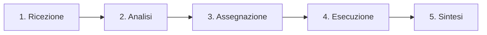

# 📚 Documentazione: LLM Multi-Agent Orchestra Dashboard


## 📋 Indice
1. [Introduzione](#introduzione)
2. [Architettura del Sistema](#architettura-del-sistema)
3. [Componenti Principali](#componenti-principali)
4. [Guida all'Uso](#guida-alluso)
5. [Flusso di Elaborazione](#flusso-di-elaborazione)
6. [Esempi Pratici](#esempi-pratici)
7. [Concetti Chiave per Data Scientists](#concetti-chiave-per-data-scientists)
8. [Personalizzazione e Estensioni](#personalizzazione-e-estensioni)
9. [FAQ](#faq)

---

## 🎯 Introduzione

### Cos'è la LLM Multi-Agent Orchestra Dashboard?

È una [**dashboard interattiva educativa**](https://claude.ai/public/artifacts/040f58d5-907e-484a-942a-6f570fefae57) che simula visivamente come funziona un sistema multi-agent basato su LLM (Large Language Models). Progettata specificamente per **junior data scientists**, permette di comprendere attraverso l'esperienza diretta come multipli LLM specializzati possano collaborare per risolvere problemi complessi.

### Obiettivi Didattici

1. **Visualizzare** il concetto astratto di orchestrazione multi-agent
2. **Dimostrare** la decomposizione di task complessi in sotto-task
3. **Mostrare** la collaborazione tra agent specializzati
4. **Illustrare** il processo di sintesi delle risposte multiple

### A Chi è Rivolta?

- 👨‍💻 **Junior Data Scientists** che vogliono capire i sistemi multi-agent
- 🎓 **Studenti** di AI/ML interessati alle architetture avanzate
- 💼 **Professionisti** che devono presentare concetti di AI orchestration
- 🔬 **Ricercatori** che esplorano pattern di collaborazione tra AI

---

## 🏗️ Architettura del Sistema

### Overview Architetturale

```
┌─────────────────────────────────────────────────────────┐
│                    USER INTERFACE                        │
│  ┌─────────────┐  ┌──────────────┐  ┌───────────────┐  │
│  │   Input     │  │ Visualization │  │   Message     │  │
│  │   Panel     │  │    Canvas     │  │     Log       │  │
│  └─────────────┘  └──────────────┘  └───────────────┘  │
└─────────────────────────────────────────────────────────┘
                            │
                            ▼
┌─────────────────────────────────────────────────────────┐
│                  ORCHESTRATION LAYER                     │
│  ┌─────────────────────────────────────────────────┐   │
│  │              Manager LLM (Orchestrator)          │   │
│  │  • Task Decomposition                            │   │
│  │  • Agent Selection                               │   │
│  │  • Response Synthesis                            │   │
│  └─────────────────────────────────────────────────┘   │
└─────────────────────────────────────────────────────────┘
                            │
        ┌───────────────────┼───────────────────┐
        ▼                   ▼                   ▼
┌──────────────┐   ┌──────────────┐   ┌──────────────┐
│ Math Agent   │   │ Search Agent │   │Creative Agent│
│ (Calculator) │   │  (Retrieval) │   │ (Generator)  │
└──────────────┘   └──────────────┘   └──────────────┘
                            │
                            ▼
                   ┌──────────────┐
                   │Analyst Agent │
                   │  (Insights)  │
                   └──────────────┘
```

### Componenti del Sistema

| Componente | Ruolo | Responsabilità |
|------------|-------|----------------|
| **Manager LLM** | Orchestratore principale | Analizza query, decompone task, coordina agent |
| **Math Agent** | Specialista numerico | Calcoli, statistiche, conversioni |
| **Search Agent** | Recupero informazioni | Ricerca dati, fatti, notizie aggiornate |
| **Creative Agent** | Generazione contenuti | Storie, idee, brainstorming creativo |
| **Analyst Agent** | Analisi dati | Pattern recognition, trend analysis, insights |

---

## 🔧 Componenti Principali

### 1. Manager LLM (Orchestratore)

**Caratteristiche:**
- 🧠 Icona: Brain (cervello)
- 🎨 Colore: Gradiente viola-rosa
- 📍 Posizione: Centro della visualizzazione

**Funzioni:**
```javascript
// Pseudo-codice del processo del Manager
function managerProcess(userQuery) {
  1. analyzeQuery(userQuery)        // Comprende l'intento
  2. decomposeTask(query)           // Scompone in sotto-task
  3. selectAgents(subtasks)         // Sceglie agent appropriati
  4. coordinateExecution(agents)    // Gestisce esecuzione parallela
  5. synthesizeResponses(results)   // Combina risultati finali
}
```

### 2. Agent Specializzati

#### Math Agent 🧮
```javascript
{
  id: 'math',
  name: 'Agent Matematico',
  icon: Calculator,
  color: 'bg-blue-500',
  capabilities: [
    'Calcoli complessi',
    'Analisi statistiche',
    'Conversioni unità',
    'Percentuali e proporzioni'
  ]
}
```

#### Search Agent 🔍
```javascript
{
  id: 'search',
  name: 'Agent Ricerca',
  icon: Search,
  color: 'bg-green-500',
  capabilities: [
    'Ricerca informazioni web',
    'Recupero dati storici',
    'Verifica fatti',
    'Aggiornamenti real-time'
  ]
}
```

#### Creative Agent 🎨
```javascript
{
  id: 'creative',
  name: 'Agent Creativo',
  icon: Palette,
  color: 'bg-purple-500',
  capabilities: [
    'Generazione storie',
    'Ideazione creativa',
    'Brainstorming',
    'Content creation'
  ]
}
```

#### Analyst Agent 📊
```javascript
{
  id: 'analyst',
  name: 'Agent Analista',
  icon: BarChart3,
  color: 'bg-orange-500',
  capabilities: [
    'Analisi trend',
    'Pattern recognition',
    'Data insights',
    'Report generation'
  ]
}
```

### 3. Sistema di Visualizzazione

#### Stati Visivi degli Agent

| Stato | Aspetto Visivo | Significato |
|-------|----------------|-------------|
| **Inattivo** | Opacità 60%, nessun anello | Agent in attesa |
| **Attivo** | Opacità 90%, anello bianco, pulsazione | Agent in elaborazione |
| **Completato** | Opacità 100%, icona ✨, scala 110% | Task completato |

#### Animazioni e Feedback

- **Pulsazione**: Indica elaborazione in corso
- **Linee animate**: Mostrano comunicazione tra Manager e Agent
- **Progress bar**: 5 step del processo di elaborazione
- **Fade-in messaggi**: Apparizione graduale dei log

---

## 📖 Guida all'Uso

### 1. Primo Accesso

All'apertura della dashboard:
1. **Tutorial automatico**: Spiega il funzionamento del sistema
2. **Interfaccia pulita**: Mostra l'orchestra di agent in stato di riposo
3. **Esempi pronti**: Query predefinite per iniziare subito

### 2. Inserimento Query

#### Come scrivere query efficaci:

✅ **Query BUONE** (multi-competenza):
- "Qual è la popolazione di Tokyo e come si confronta percentualmente con il Giappone?"
- "Analizza i trend dell'AI nel 2024 e suggerisci 3 idee innovative per startup"
- "Crea una storia su un robot e calcola quante parole contiene"

❌ **Query MENO EFFICACI** (singola competenza):
- "Quanto fa 2+2?" (solo Math Agent)
- "Chi è il presidente degli USA?" (solo Search Agent)

### 3. Interpretazione dei Risultati

#### Log delle Comunicazioni

I messaggi sono codificati per colore:
- 🟣 **Viola**: Messaggi di sistema dal Manager
- 🔵 **Blu**: Decomposizione task
- 🟡 **Giallo**: Agent in elaborazione
- 🟢 **Verde**: Completamento task
- ⚪ **Grigio**: Messaggi generali

#### Esempio di Log:
```
🎯 Manager LLM sta analizzando la tua richiesta...
📋 Ho identificato 2 sotto-task da assegnare:
1. Cercare informazioni e dati aggiornati
2. Eseguire calcoli numerici e percentuali
🤝 Sto assegnando i task a 2 agent specializzati...
[Agent Ricerca] sta lavorando su: Cercare informazioni...
[Agent Matematico] sta lavorando su: Eseguire calcoli...
✅ Agent Ricerca ha completato il suo task!
✅ Agent Matematico ha completato il suo task!
🎭 Manager LLM sta combinando tutte le risposte...
```

---

## 🔄 Flusso di Elaborazione

### I 5 Step del Processo



#### Step 1: Ricezione
- Manager riceve la query utente
- Validazione input
- Preparazione elaborazione

#### Step 2: Analisi (Decomposizione)
```javascript
function decomposeTask(query) {
  // Analizza parole chiave
  if (query.includes('calcola', 'percentuale')) → Math Agent
  if (query.includes('trova', 'cerca', 'notizie')) → Search Agent
  if (query.includes('crea', 'storia', 'idea')) → Creative Agent
  if (query.includes('analizza', 'trend')) → Analyst Agent
}
```

#### Step 3: Assegnazione
- Selezione agent appropriati
- Definizione task specifici per ogni agent
- Attivazione visiva degli agent selezionati

#### Step 4: Esecuzione (Parallela)
- Agent lavorano simultaneamente
- Simulazione di latenza realistica (2-4 secondi)
- Feedback visivo del progresso

#### Step 5: Sintesi
- Raccolta risposte da tutti gli agent
- Combinazione intelligente dei risultati
- Formattazione risposta finale

---

## 💡 Esempi Pratici

### Esempio 1: Query Multi-Dominio

**Input**: "Qual è la popolazione di Milano e quanto rappresenta in percentuale rispetto all'Italia?"

**Processo**:
1. **Manager** identifica 2 competenze necessarie:
   - Ricerca dati demografici → Search Agent
   - Calcolo percentuale → Math Agent

2. **Search Agent** trova:
   - Milano: 1,396,059 abitanti
   - Italia: 58,997,201 abitanti

3. **Math Agent** calcola:
   - Percentuale: (1,396,059 / 58,997,201) × 100 = 2.37%

4. **Sintesi finale**: Combinazione dei dati con contesto

### Esempio 2: Task Creativo-Analitico

**Input**: "Crea una breve storia su AI e analizza i sentiment principali"

**Processo**:
1. **Creative Agent**: Genera storia originale
2. **Analyst Agent**: Analizza temi e sentiment
3. **Manager**: Presenta storia + analisi integrata

### Esempio 3: Ricerca e Elaborazione

**Input**: "Trova le ultime 3 notizie su quantum computing e riassumile in 50 parole"

**Processo**:
1. **Search Agent**: Recupera notizie recenti
2. **Analyst Agent**: Estrae punti chiave
3. **Creative Agent**: Sintetizza in 50 parole
4. **Manager**: Coordina e presenta risultato finale

---

## 🎓 Concetti Chiave per Data Scientists

### 1. Decomposizione del Problema

**Principio**: Problemi complessi → sotto-problemi gestibili

```python
# Analogia in programmazione
def solve_complex_problem(problem):
    subtasks = decompose(problem)
    results = []
    for task in subtasks:
        agent = select_best_agent(task)
        result = agent.execute(task)
        results.append(result)
    return synthesize(results)
```

### 2. Specializzazione degli Agent

**Vantaggi**:
- 🎯 **Precisione**: Ogni agent eccelle nel suo dominio
- ⚡ **Efficienza**: Elaborazione parallela
- 🔧 **Manutenibilità**: Agent indipendenti e modulari
- 📈 **Scalabilità**: Facile aggiungere nuovi agent

### 3. Orchestrazione vs Coordinazione

| Orchestrazione | Coordinazione |
|----------------|---------------|
| Controllo centralizzato (Manager) | Controllo distribuito |
| Flusso predefinito | Flusso emergente |
| Più prevedibile | Più flessibile |
| Nostro approccio | Alternativa possibile |

### 4. Pattern di Comunicazione

```
Manager ←→ Agent: Comunicazione diretta
Agent ←→ Agent: Attraverso il Manager (mediata)
```

### 5. Gestione dello Stato

La dashboard mantiene:
- **Stato globale**: Query, step corrente, agent attivi
- **Stato per agent**: Task assegnati, risposte
- **Storia comunicazioni**: Log completo

---

## 🛠️ Personalizzazione e Estensioni

### Aggiungere un Nuovo Agent

```javascript
// 1. Definisci il nuovo agent
const newAgent = {
  id: 'translator',
  name: 'Agent Traduttore',
  icon: Globe,
  color: 'bg-indigo-500',
  description: 'Traduce testi in multiple lingue',
  examples: ['traduzioni', 'lingue', 'internazionalizzazione']
};

// 2. Aggiungi alla lista agents
const agents = {
  ...existingAgents,
  translator: newAgent
};

// 3. Modifica decomposeTask per riconoscere task di traduzione
if (query.includes('traduci') || query.includes('lingua')) {
  tasks.push({ 
    agent: 'translator', 
    description: 'Tradurre contenuti' 
  });
}
```

### Modificare i Tempi di Simulazione

```javascript
// In processQuery()
const DELAYS = {
  managerThinking: 1500,    // Tempo analisi Manager
  decomposition: 1000,      // Tempo decomposizione
  agentWork: {
    min: 2000,              // Tempo minimo agent
    max: 4000               // Tempo massimo agent
  },
  synthesis: 2000           // Tempo sintesi finale
};
```

### Personalizzare le Risposte Simulate

```javascript
const simulateAgentResponse = async (agentId, tasks) => {
  const responses = {
    math: generateMathResponse(tasks),
    search: generateSearchResponse(tasks),
    creative: generateCreativeResponse(tasks),
    analyst: generateAnalystResponse(tasks)
  };
  return responses[agentId];
};
```

### Aggiungere Nuove Animazioni

```css
/* Aggiungi in style jsx */
@keyframes bounce {
  0%, 100% { transform: translateY(0); }
  50% { transform: translateY(-10px); }
}

.animate-bounce {
  animation: bounce 1s infinite;
}
```

### Implementare Persistenza

```javascript
// Salvare stato in localStorage
const saveState = (state) => {
  const stateToSave = {
    queries: state.queries,
    responses: state.responses,
    timestamp: Date.now()
  };
  // NON usare in artifacts Claude.ai!
  // localStorage.setItem('orchestraState', JSON.stringify(stateToSave));
};
```

---

## ❓ FAQ

### Q: È una simulazione o un sistema reale?
**A**: È una **simulazione educativa**. In un sistema reale, ogni agent sarebbe un vero LLM con API e capacità specifiche.

### Q: Posso usarlo in produzione?
**A**: No, è progettato per **scopi didattici**. Per produzione, considera framework come LangChain, AutoGen, o CrewAI.

### Q: Come posso implementare un vero sistema multi-agent?
**A**: Ecco i passi principali:
1. Scegli un framework (LangChain, LlamaIndex, etc.)
2. Configura LLM per ogni agent
3. Implementa logica di orchestrazione
4. Aggiungi tools/API per ogni agent
5. Gestisci stato e memoria
6. Implementa error handling

### Q: Quali sono i costi di un sistema reale?
**A**: Dipende da:
- Numero di agent
- Frequenza di utilizzo
- Modelli LLM scelti (GPT-4, Claude, etc.)
- Complessità delle query

### Q: Posso modificare il codice?
**A**: Sì! Il codice è completamente personalizzabile. Vedi la sezione [Personalizzazione](#personalizzazione-e-estensioni).

### Q: Supporta altre lingue oltre l'italiano?
**A**: L'interfaccia è in italiano, ma puoi facilmente:
1. Tradurre i testi dell'UI
2. Adattare la logica di decomposizione per altre lingue
3. Aggiungere un agent traduttore

### Q: Come gestisce query ambigue?
**A**: Il sistema:
1. Assegna task al Search Agent per query generiche
2. Può attivare multiple interpretazioni
3. Il Manager sintetizza cercando coerenza

### Q: Posso vedere metriche di performance?
**A**: Attualmente mostra:
- Tempo per step (visivamente)
- Agent attivati
- Log completo

Per metriche avanzate, potresti aggiungere:
- Tempo totale elaborazione
- Tempo per agent
- "Confidence score" simulato

---

## 📚 Risorse Aggiuntive

### Per Approfondire

1. **Paper Fondamentali**:
   - "ReAct: Synergizing Reasoning and Acting in Language Models"
   - "HuggingGPT: Solving AI Tasks with ChatGPT and its Friends"

2. **Framework Open Source**:
   - [LangChain](https://langchain.com/)
   - [AutoGen](https://microsoft.github.io/autogen/)
   - [CrewAI](https://crewai.io/)
   - [LlamaIndex](https://llamaindex.ai/)

3. **Tutorial e Guide**:
   - Building Multi-Agent Systems with LangChain
   - AutoGen Multi-Agent Conversation Framework
   - Prompt Engineering for Agent Systems

### Prossimi Passi

1. **Sperimenta** con la dashboard per familiarizzare
2. **Modifica** il codice per aggiungere funzionalità
3. **Studia** i framework reali menzionati
4. **Costruisci** un piccolo sistema multi-agent reale
5. **Condividi** le tue scoperte con la community!

---

## 🎯 Conclusione

La **LLM Multi-Agent Orchestra Dashboard** è uno strumento didattico potente per comprendere visivamente come funzionano i sistemi multi-agent moderni. Attraverso l'interazione diretta e la visualizzazione in tempo reale, i concetti astratti diventano tangibili e comprensibili.

Ricorda: questo è solo l'inizio del tuo viaggio nel mondo degli agent AI. I sistemi reali sono più complessi ma seguono gli stessi principi fondamentali che hai appreso qui.

**Buon apprendimento e buona esplorazione del mondo multi-agent! 🚀**

---

*Versione: 1.0 | Ultimo aggiornamento: 2024 | Creato per Junior Data Scientists*
